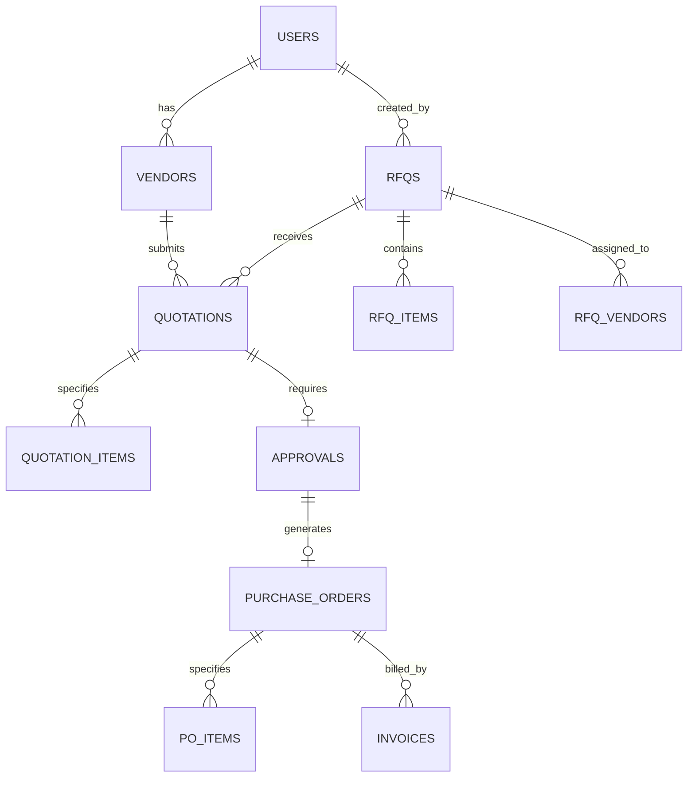

# Database Schema

VendorBridge uses PostgreSQL (via Neon) as its data persistence layer. The schema is highly relational to ensure data integrity across the procurement workflow.

## Entity Relationship Diagram (ERD)

## Table Definitions

### 1. `users`
Core authentication table for all system users (admins, officers, managers, vendors).
- `id` (UUID, PK)
- `full_name` (VARCHAR)
- `email` (VARCHAR, UNIQUE)
- `password_hash` (VARCHAR)
- `role` (ENUM: 'admin', 'procurement_officer', 'manager', 'vendor')

### 2. `vendors`
Detailed vendor profiles. A `user` with role='vendor' possesses one record here.
- `id` (UUID, PK)
- `user_id` (UUID, FK -> users)
- `company_name` (VARCHAR)
- `category`, `status`, `rating`

### 3. `rfqs`
Request for Quotations created by internal staff.
- `id` (UUID, PK)
- `rfq_number` (VARCHAR, UNIQUE)
- `title`, `description`, `department`
- `status` (ENUM: 'draft', 'published', 'closed', 'awarded')
- `deadline` (TIMESTAMP)

### 4. `rfq_vendors` (Join Table)
Explicit invites given to vendors for a specific RFQ.
- `rfq_id` (UUID, FK)
- `vendor_id` (UUID, FK)

### 5. `rfq_items`
Line-item specifications requested in the RFQ.
- `id` (UUID, PK)
- `rfq_id` (UUID, FK -> rfqs)
- `item_name`, `quantity`, `unit`, `estimated_price`

### 6. `quotations`
Bids submitted by vendors in response to RFQs.
- `id` (UUID, PK)
- `quote_number` (VARCHAR, UNIQUE)
- `rfq_id` (UUID, FK -> rfqs)
- `vendor_id` (UUID, FK -> vendors)
- `status` (ENUM: 'draft', 'submitted', 'selected', 'rejected')
- `total_amount`, `validity_days`

### 7. `quotation_items`
Line-item pricing submitted by the vendor.
- `id` (UUID, PK)
- `quotation_id` (UUID, FK -> quotations)
- `unit_price`, `quantity`, `total_price`

### 8. `approvals`
Internal approval requests for winning quotations.
- `id` (UUID, PK)
- `quotation_id` (UUID, FK -> quotations)
- `status` (ENUM: 'pending', 'approved', 'rejected')
- `requester_id`, `approver_id`

### 9. `purchase_orders`
Auto-generated formal orders (created exclusively upon approval).
- `id` (UUID, PK)
- `po_number` (VARCHAR, UNIQUE)
- `approval_id`, `quotation_id`, `vendor_id`, `rfq_id`
- `status` (ENUM: 'issued', 'acknowledged', 'fulfilled', 'cancelled')

### 10. `invoices`
Generated by the vendor against an issued PO.
- `id` (UUID, PK)
- `invoice_number` (VARCHAR, UNIQUE)
- `po_id` (UUID, FK -> purchase_orders)
- `status` (ENUM: 'pending', 'approved', 'paid', 'rejected')
- `total_amount`, `tax_amount`, `grand_total`

### 11. `activity_logs`
Unalterable system-wide audit trail.
- `id` (UUID, PK)
- `user_id` (UUID, FK -> users)
- `action` (VARCHAR) - *e.g., 'QUOTE_APPROVED', 'PO_GENERATED'*
- `entity_type` (VARCHAR), `entity_id` (UUID)
- `metadata` (JSONB)
