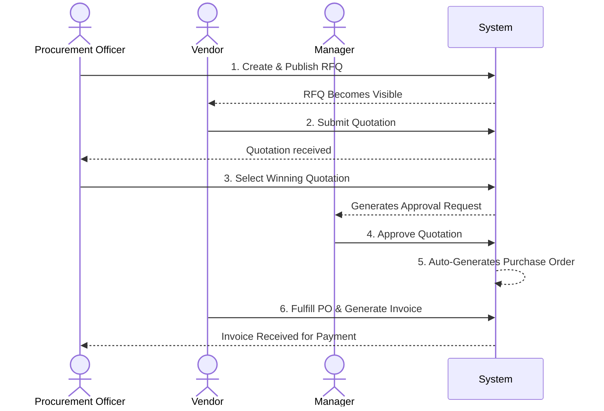

# System Architecture

VendorBridge is built using a modern decoupled architecture. The frontend application is built using React (Vite) and communicates via REST APIs with the Node.js/Express.js backend. The backend persists data in a PostgreSQL database hosted on Neon.

## High-Level Architecture Diagram

```mermaid
graph TD
    Client[React + Vite Frontend]
    Client -- "REST API (JSON over HTTP)" --> API[Express.js Backend]
    
    subgraph Backend Architecture
        API --> Auth[Auth Middleware]
        Auth --> RBAC[Role Guard Middleware]
        RBAC --> Controllers
        Controllers --> Services[Business Logic Layer]
        Services --> DB[PostgreSQL (Neon)]
    end
    
    Services --> Logger[Activity Logger]
    Logger --> DB
```

## Application Layers

### 1. Presentation Layer (Frontend)
- **Framework**: React.js with Vite for fast builds and hot module replacement.
- **Routing**: Client-side routing using `react-router-dom`.
- **Components**: Reusable, accessible UI components built with Tailwind CSS, lucide-react icons, and shadcn/ui principles.
- **State**: `zustand` for lightweight global state (e.g., authentication) combined with local component state.
- **Data Fetching**: Dedicated API wrappers using standard `fetch` or `axios` mapped strictly to backend routes.

### 2. Application Layer (Backend Node.js)
- **Routing**: Organized by entity domain (`auth`, `rfqs`, `quotations`, etc.).
- **Controllers**: Thin controllers that parse incoming HTTP requests, delegate processing to services, and format standardized responses.
- **Services**: The heart of the business logic. Contains data validation, workflow rule enforcement (e.g., "Cannot issue PO without Manager approval"), and SQL query execution.
- **Middleware**:
    - `auth.js`: Verifies JWT tokens and sets the initial user context.
    - `roleGuard.js`: Enforces Role-Based Access Control on specific routes.
    - `validate.js`: Enforces schema shapes for incoming JSON bodies using Zod.
    - `errorHandler.js`: A global error handling interface ensuring the client always receives a clean, standardized JSON error envelope.

### 3. Data Layer
- **Neon Postgres**: Relational data modeling keeping data strictly normalized.
- **Sequences**: Independent sequences ensure non-colliding formatted IDs (e.g., `RFQ-2026-0001`, `PO-2026-0001`).

## Procurement Workflow Engine

The architecture explicitly enforces a directional workflow where state changes in one entity trigger or unlock subsequent entities.



### Key Architectural Decisions
- **Event Logging as a Rule**: All write-actions (POST/PUT/PATCH/DELETE) are mandated to call `activityLogger.js`. This guarantees an unalterable system-wide audit trail.
- **Centralized Tax Calculation**: Taxes and totals are never trusted from the client. They are calculated dynamically inside the `invoice.service.js` and `po.service.js`.
- **Idempotency Checks**: Endpoints like `submit` or `publish` strictly verify the entity's status before transitioning it to prevent race conditions.
